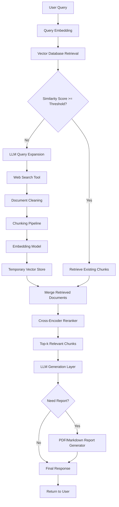

# Agent Orchestrator Implementation Plan

File: `agent_readme.md`

---

# Intelligent Financial Research Agent
## Static Workflow RAG-Orchestrator Design with LangGraph

This document describes the implementation plan for the orchestrator system using:

- LangGraph
- LangChain
- Retrieval-Augmented Generation (RAG)
- Conditional Workflow Routing
- Cross-Encoder Reranking
- LLM-based Response Generation

Unlike autonomous LLM agents that dynamically decide every action, this system follows a deterministic workflow pipeline with controlled branching logic.

The system focuses on:
- robust retrieval,
- controllable orchestration,
- explainable workflows,
- low hallucination generation,
- production-style AI architecture.

---

# 1. System Design Philosophy

This project does NOT implement:
- autonomous recursive agents,
- uncontrolled tool-calling,
- AutoGPT-style reasoning loops.

Instead, the system uses:

```text
Deterministic Workflow
+
Conditional Retrieval
+
External Search Fallback
+
Cross-Encoder Reranking
+
LLM-based Synthesis
```

The LLM is primarily used for:
- query enhancement,
- response generation,
- report writing.

Workflow control remains deterministic and framework-driven.

---

# 2. Why Static Workflow Instead of Autonomous Agent

## Problems with Fully Autonomous Agents

Autonomous agents:
- are difficult to debug,
- have unstable execution,
- increase hallucination risk,
- are expensive to run,
- are harder to evaluate academically.

For financial systems, deterministic pipelines are preferred because:
- retrieval quality matters,
- explainability matters,
- controllability matters,
- hallucination reduction is critical.

---

# 3. Proposed Workflow Architecture



---

# 4. Core Workflow Explanation

# Step 1 — User Query

The user submits:
- financial question,
- stock analysis request,
- report request,
- uploaded document query.

Example:

```text
Analyze Tesla stock performance this week.
```

---

# Step 2 — Initial Vector Retrieval

The query is:
- embedded,
- searched against the vector database.

The system retrieves:
- top-k relevant chunks,
- similarity scores.

---

# Step 3 — Similarity Threshold Check

The orchestrator evaluates:

```python
if similarity_score >= threshold:
    use_existing_context()
else:
    trigger_web_search()
```

This is the primary conditional routing mechanism.

---

# Step 4 — LLM Query Expansion

If retrieval confidence is low:

The LLM generates:
- enhanced search queries,
- financial keyword expansion,
- alternative formulations.

Example:

```text
Original Query:
"Tesla stock this week"

Expanded Search Queries:
- Tesla earnings this week
- Tesla market news latest
- Tesla stock analyst sentiment
```

The LLM is ONLY used for:
- improving retrieval/search quality,
- not autonomous decision making.

---

# Step 5 — Web Search Tool

The search tool retrieves:
- financial news,
- macroeconomic events,
- market sentiment articles,
- recent company updates.

Possible APIs:
- SerpAPI


---

# Step 6 — Document Ingestion Pipeline

Retrieved web documents go through:

```text
cleaning
→ chunking
→ embedding
→ temporary indexing
```

This allows dynamic context augmentation.

---

# Step 7 — Context Merging

The system combines:
- existing vector DB retrievals,
- newly searched documents.

This creates a larger retrieval pool.

---

# Step 8 — Cross-Encoder Reranking

A cross-encoder reranker evaluates:
- semantic relevance,
- contextual alignment,
- ranking quality.

Purpose:
- improve retrieval precision,
- reduce irrelevant chunks,
- improve final generation quality.

---

## Recommended Models

Possible rerankers:
- BAAI/bge-reranker-base
- ms-marco MiniLM cross-encoder

---

# Step 9 — Final Chunk Selection

Top-k reranked chunks are selected.

Example:
```python
top_k = 5
```

These chunks become the final context for generation.

---

# Step 10 — LLM Generation Layer

The LLM receives:
- user query,
- reranked context chunks,
- optional financial data.

The LLM performs:
- answer synthesis,
- financial reasoning,
- summarization,
- report generation.

---

## Supported LLM Options

### Cloud APIs
- OpenAI GPT
- Gemini API

### Local Models
- Llama 3
- Mistral
- DeepSeek
- Qwen

---

# Step 11 — Report Generation

If the user requests:
- report,
- analysis summary,
- investment document,

the output is converted into:
- markdown,
- PDF,
- DOCX.

---

# 5. LangGraph Usage

LangGraph is used for:
- workflow orchestration,
- conditional branching,
- state handling,
- pipeline execution.

NOT for autonomous planning.

---

# 6. LangGraph Workflow Nodes

| Node | Responsibility |
|---|---|
| input_node | preprocess query |
| retrieval_node | vector DB retrieval |
| threshold_node | relevance checking |
| query_expansion_node | LLM query enhancement |
| web_search_node | retrieve internet data |
| ingestion_node | chunk + embed new docs |
| merge_node | combine retrievals |
| rerank_node | cross-encoder reranking |
| generation_node | final LLM synthesis |
| report_node | PDF/markdown export |
| output_node | return response |

---

# 7. Recommended Folder Structure

```text
backend/
│
├── agent/
│   ├── orchestrator.py
│   ├── workflow.py
│   ├── state.py
│   ├── routing.py
│   └── prompts/
│
├── tools/
│   ├── web_search_tool.py
│   ├── report_writer.py
│   └── reranker.py
│
├── rag/
│   ├── chunking.py
│   ├── embedding.py
│   ├── retriever.py
│   ├── ingestion.py
│   └── vector_store.py
│
├── llm/
│   ├── local_llm.py
│   └── openai_llm.py
│
├── memory/
│   └── session_memory.py
```

---

# 8. Example Workflow Execution

## User Query

```text
Summarize NVIDIA market sentiment this week.
```

---

## Pipeline

```text
1. Retrieve from vector DB
2. Similarity score too low
3. LLM generates search queries
4. Search recent financial news
5. Ingest retrieved articles
6. Chunk + embed articles
7. Merge retrieval results
8. Cross-encoder reranking
9. Select top-k chunks
10. Generate final analysis
11. Export PDF report
```

---

# 9. Research Contributions

This project investigates:

- adaptive retrieval workflows,
- conditional search augmentation,
- chunking strategy optimization,
- reranking effectiveness,
- retrieval precision,
- hallucination reduction,
- production-style RAG architecture.

---

# 10. Evaluation Metrics

## Retrieval Metrics

- Recall@k
- Precision@k
- MRR
- nDCG

---

## Generation Metrics

- hallucination rate,
- response relevance,
- groundedness,
- factual consistency.

---

## System Metrics

- retrieval latency,
- reranking latency,
- generation latency,
- pipeline throughput.

---

# 11. Recommended Libraries

## Core Framework

```bash
pip install langchain
pip install langgraph
```

---

## Vector Database

```bash
pip install chromadb
pip install faiss-cpu
```

---

## Embeddings

```bash
pip install sentence-transformers
```

---

## Reranking

```bash
pip install transformers
```

---

## APIs

```bash
pip install openai
pip install tavily-python
pip install yfinance
```

---

# 12. Final System Objective

Build a controlled intelligent financial research system capable of:

- adaptive retrieval,
- web-augmented RAG,
- contextual financial reasoning,
- reranked semantic retrieval,
- structured report generation,
- explainable workflow execution.

The final architecture should resemble a realistic production AI retrieval pipeline rather than an uncontrolled autonomous chatbot agent.