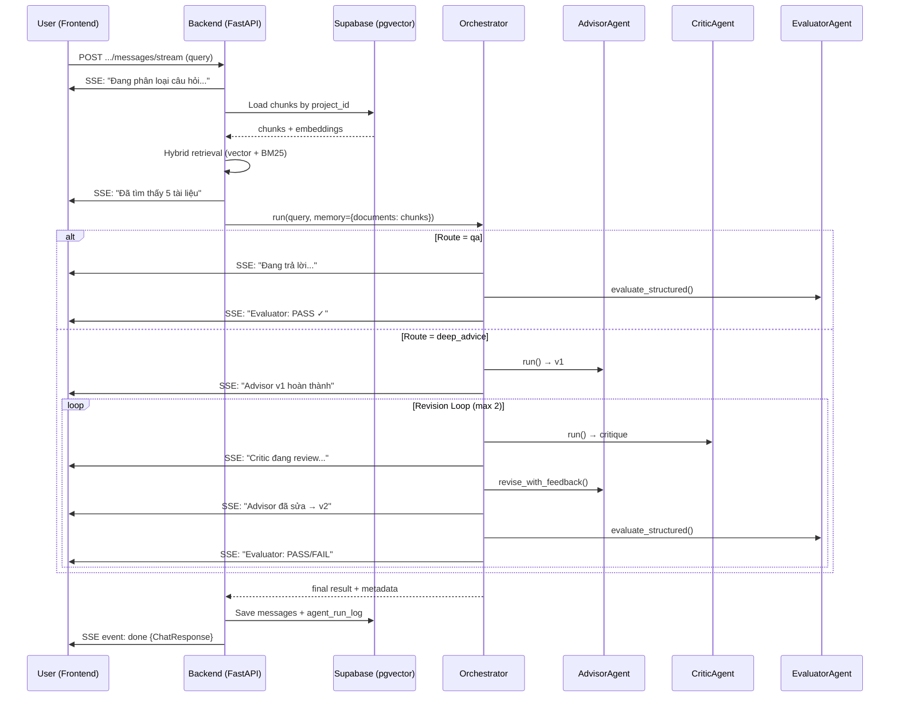

# Tích hợp Multi-Agent Pipeline vào Frontend Chat Interface

## Tổng quan

Hiện tại:
- **CLI** (`ai_integration.main`) chạy multi-agent pipeline với RAG từ **vector DB local** → hoạt động tốt
- **Frontend chat** gọi `POST /projects/{pid}/conversations/{cid}/messages` → backend `generate_answer.py` → RAG từ **Supabase pgvector** → trả lời đơn giản (không multi-agent)

**Mục tiêu:** Kết nối multi-agent pipeline (`ai_integration/`) vào backend API, sử dụng Supabase pgvector thay vì local DB, và hiển thị trên frontend với progress updates + agent trace panel.

---

## Proposed Changes

### Component 1: Backend — Supabase Retrieval Adapter

Tạo module bridge để `ai_integration` orchestrator dùng Supabase chunks thay vì local vector DB.

#### [NEW] [supabase_adapter.py](file:///Users/macos/Documents/Swinburne/COS30018/Project/Group3_ThemeD_FinancialAgent/backend/api/supabase_adapter.py)

Module adapter chuyển đổi Supabase chunks sang format mà `ai_integration` orchestrator hiểu:

- `load_context_docs(project_id, query, max_results=5)` → `list[dict]`
  - Gọi `load_chunks_from_database(project_id)` từ `generate_answer.py`
  - Dùng `HybridMultiQueryRetriever` để tìm top-K chunks liên quan nhất
  - Chuyển đổi kết quả sang format `{"text": ..., "content": ..., "source": ..., "page": ..., "score": ...}` mà orchestrator mong đợi
- `search_additional_context(project_id, query)` → `list[dict]`
  - Dùng khi Evaluator phát hiện `missing_topics` và cần search thêm

---

### Component 2: Backend — Multi-Agent Chat Handler

#### [NEW] [multi_agent_handler.py](file:///Users/macos/Documents/Swinburne/COS30018/Project/Group3_ThemeD_FinancialAgent/backend/api/multi_agent_handler.py)

Module trung gian điều phối multi-agent pipeline:

- `run_multi_agent_chat(query, project_id, conversation_id, image_base64=None, pdf_chunks=None)` → `dict`
  - Load context docs từ Supabase adapter
  - Chuẩn bị history-aware query (dùng `prepare_history_aware_query` hiện có)
  - Gọi `PlanningOrchestrator.run()` với context docs đã load từ Supabase
  - Override orchestrator's internal retrieval để dùng Supabase adapter thay vì local DB
  - Trả về `{"answer": ..., "agent_run_log": ..., "route": ..., "query_variations": ..., "sources": ...}`

**Cách override retrieval trong orchestrator:**
- Orchestrator hiện tại gọi `_run_retrieval_agent` → `RetrievalAgent` → local vector store
- Thay vì refactor orchestrator, ta sẽ pass context docs đã sẵn sàng vào orchestrator qua `memory` dict
- Orchestrator sẽ skip retrieval step khi `memory["documents"]` đã có dữ liệu (logic này đã tồn tại ở [retrieval_agent.py:33-34](file:///Users/macos/Documents/Swinburne/COS30018/Project/Group3_ThemeD_FinancialAgent/ai_integration/agent1_planner/retrieval_agent.py#L33-L34))

---

### Component 3: Backend — SSE Streaming Endpoint

Để frontend hiển thị progress text theo từng bước agent.

#### [MODIFY] [projects.py](file:///Users/macos/Documents/Swinburne/COS30018/Project/Group3_ThemeD_FinancialAgent/backend/api/routers/projects.py)

Thêm endpoint SSE mới song song với endpoint hiện tại:

```python
@router.post("/{project_id}/conversations/{conversation_id}/messages/stream")
async def send_conversation_message_stream(...)
```

- Trả về `StreamingResponse` với `text/event-stream` content type
- Gửi events theo format:
  ```
  event: progress
  data: {"step": "classifying", "message": "Đang phân loại câu hỏi..."}

  event: progress
  data: {"step": "retrieving", "message": "Đang truy xuất tài liệu..."}

  event: progress
  data: {"step": "advisor_v1", "message": "Advisor đang phân tích..."}

  event: progress
  data: {"step": "critic_loop_1", "message": "Critic đang review..."}

  event: progress  
  data: {"step": "advisor_v2", "message": "Advisor đang sửa báo cáo..."}

  event: progress
  data: {"step": "evaluator_loop_1", "message": "Evaluator đang đánh giá... FAIL"}

  event: progress
  data: {"step": "evaluator_loop_2", "message": "Evaluator đang đánh giá... PASS"}

  event: done
  data: {<full ChatResponse JSON>}
  ```

> [!IMPORTANT]
> Endpoint hiện tại (`POST .../messages`) sẽ **không bị thay đổi** — giữ backward compatibility. Endpoint mới (`POST .../messages/stream`) sẽ chạy multi-agent + SSE.

#### [MODIFY] [projects.py](file:///Users/macos/Documents/Swinburne/COS30018/Project/Group3_ThemeD_FinancialAgent/backend/api/routers/projects.py) — Response Schema

Mở rộng `ChatResponse` và `MessageRead` để bao gồm agent metadata:

```python
class MessageRead(BaseModel):
    message_id: UUID
    conversation_id: UUID
    role: str
    content: str
    agent_run_log: dict | None = None   # NEW
    created_at: Optional[datetime] = None

class ChatResponse(BaseModel):
    answer: str
    query_variations: list[str]
    sources: list[dict]
    agent_run_log: dict | None = None   # NEW
    user_message: MessageRead
    assistant_message: MessageRead
```

#### [MODIFY] [projects.py](file:///Users/macos/Documents/Swinburne/COS30018/Project/Group3_ThemeD_FinancialAgent/backend/api/routers/projects.py) — Message DB Save

Lưu `agent_run_log` vào cột JSON đã tồn tại trong bảng `messages`:

```python
assistant_message = Message(
    conversation_id=...,
    role=MessageRole.ASSISTANT,
    content=rag_result["answer"],
    agent_run_log=rag_result.get("agent_run_log"),  # NEW
    created_at=...,
)
```

---

### Component 4: Backend — Orchestrator Progress Callback

#### [MODIFY] [orchestrator.py](file:///Users/macos/Documents/Swinburne/COS30018/Project/Group3_ThemeD_FinancialAgent/ai_integration/agent1_planner/orchestrator.py)

Thêm optional `progress_callback` parameter vào `PlanningOrchestrator`:

```python
class PlanningOrchestrator:
    def __init__(self, progress_callback=None):
        self.progress_callback = progress_callback
        ...
    
    def _emit_progress(self, step: str, message: str):
        if self.progress_callback:
            self.progress_callback(step, message)
```

Gọi `_emit_progress` tại các điểm quan trọng trong pipeline:
- Sau classify: `_emit_progress("classifying", "Đang phân loại câu hỏi...")`
- Sau retrieval: `_emit_progress("retrieving", "Đã tìm thấy N tài liệu liên quan")`
- Trước/sau mỗi agent trong revision loop: `_emit_progress("advisor_v1", "Advisor đang phân tích...")`

---

### Component 5: Frontend — SSE Integration + Progress Display

#### [MODIFY] [page.tsx](file:///Users/macos/Documents/Swinburne/COS30018/Project/Group3_ThemeD_FinancialAgent/frontend/src/app/project/[projectId]/chat/[conversationId]/page.tsx)

**5a. Thay `TypingIndicator` bằng `AgentProgressIndicator`:**

```tsx
function AgentProgressIndicator({ step }: { step: string }) {
  return (
    <div className="chat-bubble-assistant animate-chat-fade-in">
      <div className="flex items-center gap-2 px-2 py-1.5">
        <span className="typing-dot" style={{ animationDelay: "0ms" }} />
        <span className="typing-dot" style={{ animationDelay: "150ms" }} />
        <span className="typing-dot" style={{ animationDelay: "300ms" }} />
        <span className="ml-2 text-xs text-slate-400">{step}</span>
      </div>
    </div>
  );
}
```

**5b. Thay `axios.post` bằng `EventSource` (SSE):**

```tsx
// Thay vì:
api.post<ChatResponse>(`/projects/${projectId}/conversations/${conversationId}/messages`, formData)

// Dùng fetch + ReadableStream để đọc SSE:
const response = await fetch(`${backendUrl}/projects/${projectId}/conversations/${conversationId}/messages/stream`, {
  method: "POST",
  body: formData,
  headers: { "Authorization": `Bearer ${authToken}` },
});
const reader = response.body.getReader();
// Parse SSE events, update progressStep state
```

**5c. Thêm `AgentTracePanel` collapsible:**

Hiển thị bên dưới mỗi assistant message (khi có `agent_run_log`):

```tsx
function AgentTracePanel({ log }: { log: AgentRunLog }) {
  const [expanded, setExpanded] = useState(false);
  return (
    <div className="mt-2 border-t border-slate-100 pt-2">
      <button onClick={() => setExpanded(!expanded)} className="text-xs text-slate-400 hover:text-slate-600">
        {expanded ? "▼" : "▶"} Agent Trace ({log.route} • {log.workflow_steps?.length ?? 0} steps)
      </button>
      {expanded && (
        <div className="mt-2 space-y-1 text-xs text-slate-500 font-mono">
          {log.workflow_steps?.map((step, i) => (
            <div key={i} className="flex gap-2">
              <span className="text-slate-300">{i + 1}.</span>
              <span>{step}</span>
            </div>
          ))}
          {log.evaluator_verdict && (
            <div className={`mt-1 font-semibold ${log.evaluator_verdict === "PASS" ? "text-green-500" : "text-amber-500"}`}>
              Evaluator: {log.evaluator_verdict}
            </div>
          )}
        </div>
      )}
    </div>
  );
}
```

**5d. Cập nhật `MessageRead` type và message rendering:**

```typescript
type MessageRow = {
  message_id: string;
  conversation_id: string;
  content: string;
  created_at?: string | null;
  role: "user" | "assistant" | "system" | string;
  agent_run_log?: AgentRunLog | null;       // NEW
};
```

Trong message rendering, hiển thị `AgentTracePanel` sau content khi role là assistant.

---

## Luồng hoạt động mới



---

## Open Questions

> [!IMPORTANT]
> **Q1:** Endpoint mới `/messages/stream` (SSE) sẽ chạy song song với endpoint cũ `/messages`. Frontend sẽ dùng endpoint mới, endpoint cũ vẫn hoạt động bình thường. Bạn có đồng ý giữ cả hai endpoint không?

> [!NOTE]
> **Q2:** Khi route là `qa` (câu hỏi đơn giản), pipeline hiện tại của backend (`generate_answer.py`) đã hoạt động tốt. Có nên giữ nguyên pipeline cũ cho `qa` route và chỉ dùng multi-agent cho `deep_advice`? Hay chuyển tất cả qua orchestrator?
> 
> **Đề xuất:** Tất cả đều đi qua orchestrator để thống nhất flow và tận dụng Evaluator check cho cả QA. Orchestrator sẽ tự phân loại và xử lý phù hợp.

---

## Verification Plan

### Automated Tests
```bash
# 1. Syntax check tất cả files thay đổi
python3 -c "import ast; [ast.parse(open(f).read()) for f in ['backend/api/supabase_adapter.py', 'backend/api/multi_agent_handler.py']]"

# 2. Test Supabase adapter (mock)
python3 -m pytest backend/tests/test_supabase_adapter.py -v

# 3. Test backend startup
cd backend && uvicorn api.main:app --host 0.0.0.0 --port 8000
```

### Manual Verification
1. Mở frontend → tạo conversation → gửi query qa ("What is Tesla's revenue?") → kiểm tra progress + response
2. Gửi query deep_advice ("Should I buy Nvidia stock?") → kiểm tra revision loop progress + agent trace panel
3. Kiểm tra `agent_run_log` đã lưu trong DB
4. Kiểm tra endpoint cũ `/messages` vẫn hoạt động (backward compat)
